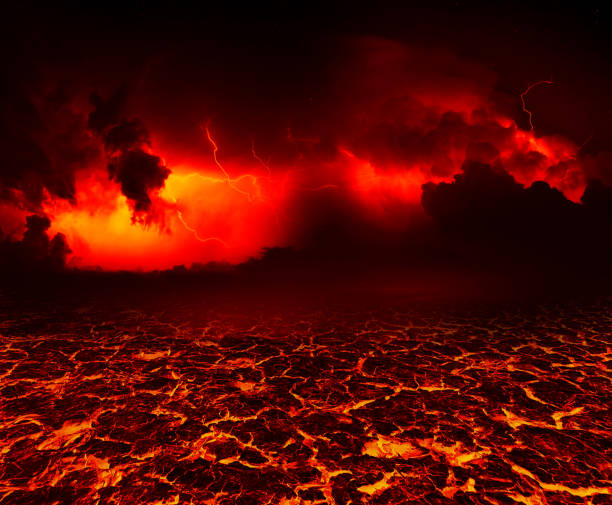
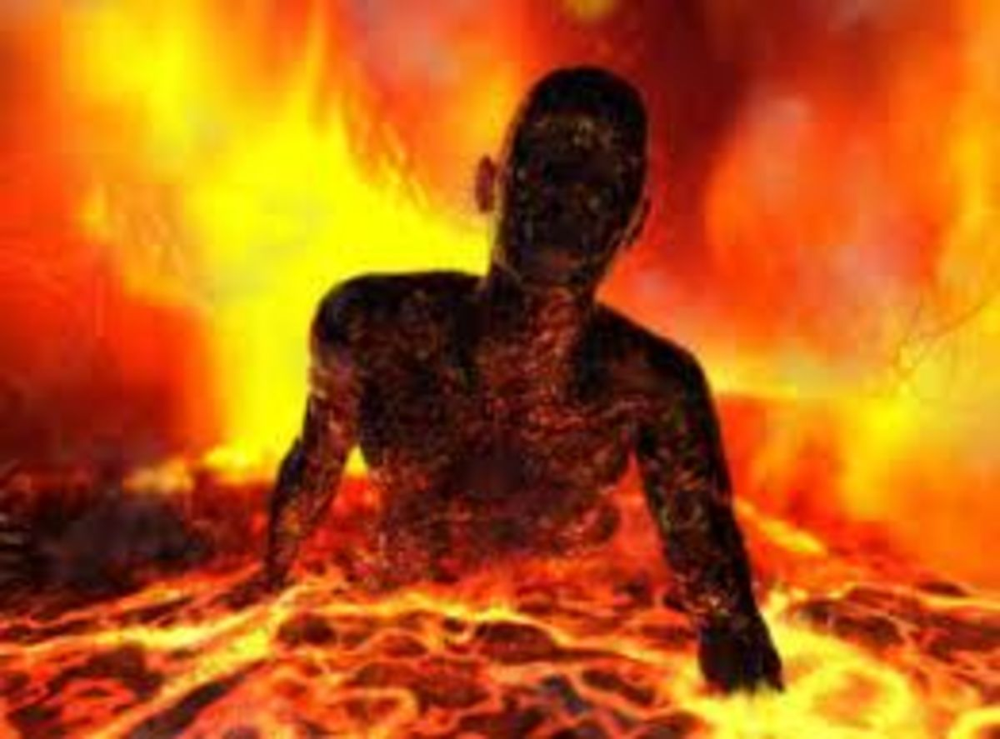
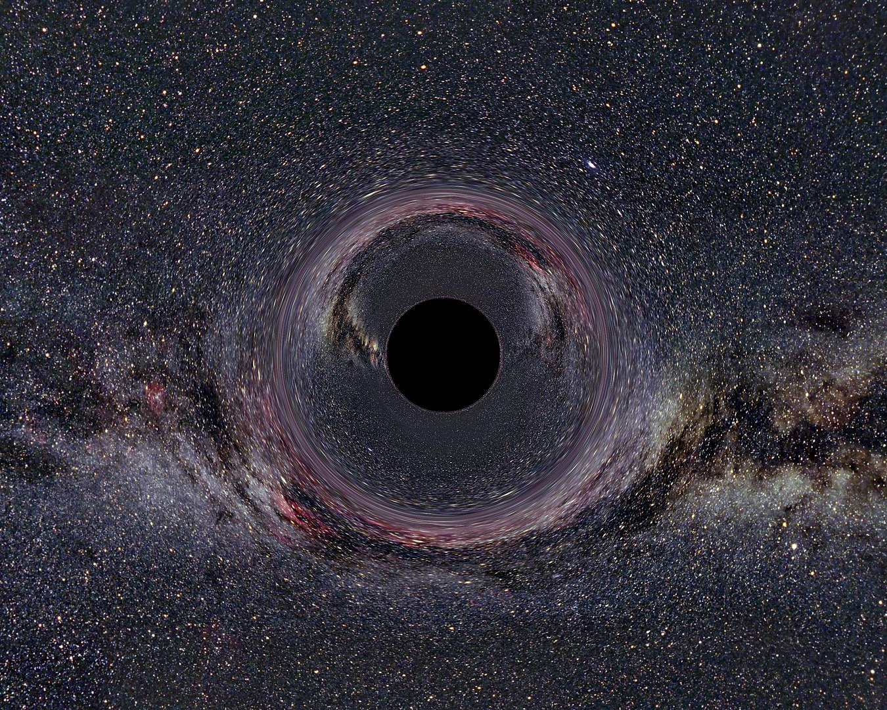
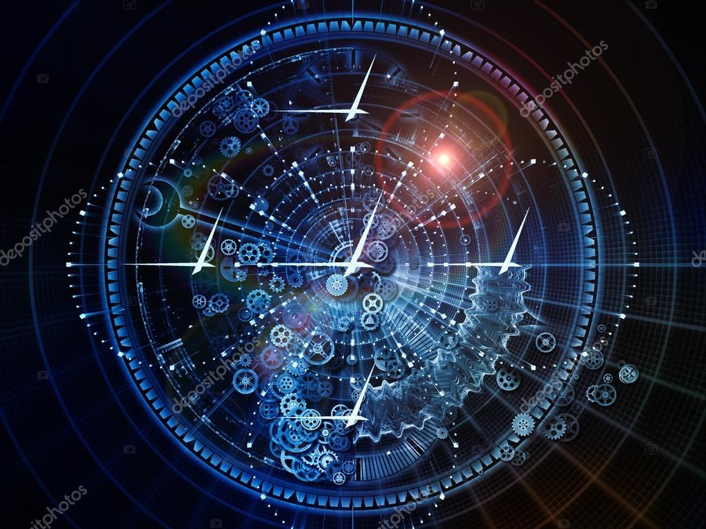
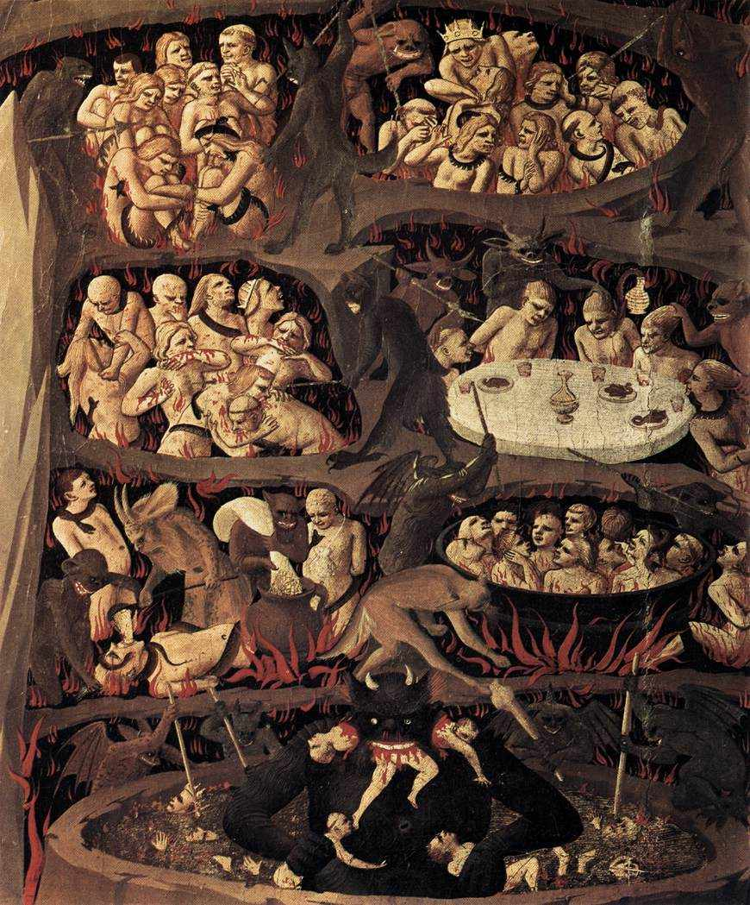
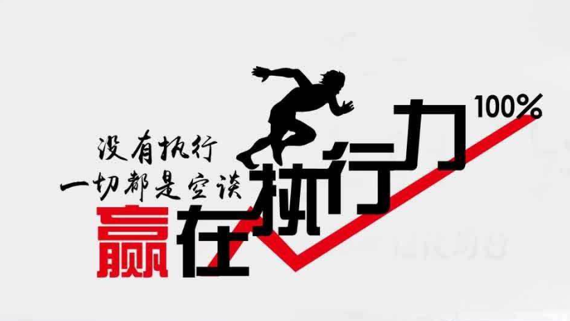

# 1.1地狱

## 3.4.2. 思维方法 - 第1阶段了解

从四个方面去思考

1. 环境
2. 身心
3. 痛苦
4. 时间

具体可以参考《慧灯之光》，更详细的可以看《大圆满前行》，《菩提道次第广论》

**3.4.2.1. 思维对比地狱痛苦的目的**

四加行里地狱的痛苦有两个地方

* 人身难得，对比地狱，我们是很幸运的，生命是来之不易的
* 轮回痛苦，是让我们了解生命的痛苦，目的不一样

**3.4.2.2. 了解 - 环境和身心**

| 了解 | 地狱 |
| :--- | :--- |
| 环境 | 地面是烧红的铁，铁上面到处是一肘高的火焰🔥，没有蓝天白云，日月，天空地面分不清，非常恐怖，没有寺庙，佛像，佛经，有地方可以听佛法，打坐 |
| 身心 | 身体比我们大几十倍，皮肤很细，碰的时候特别疼。没有机会可以拜佛，饶塔，抄经，诵咒，做义工，慈善，发菩提心 |

**3.4.2.3. 了解- 感受和寿命**

| 了解 | 地狱 |
| :--- | :--- |
| 痛苦/感受 | 一年四季一天24小时非常剧烈的痛苦，没有机会思维出离心，菩提心 |
| 时间 | 寿命特别长，上万年以上，在这么漫长的时间中就没有机会学习修行，行善的机会 |

## 3.4.3. 思维方法 - 第2阶段 对比

**3.4.3.1. 具体对比 - 环境和身心**

| 对比 | 地狱 | 我的世界 |
| :--- | :--- | :--- |
| 环境 | 地面是烧红的铁，铁上面到处是一肘高的火焰🔥，没有蓝天白云，日月，天空地面分不清，非常恐怖 | 有寺庙，佛像，佛经，有地方可以听佛法，打坐 |
| 身心 | 身体比我们大几十倍，皮肤很细，碰的时候特别疼 | 我们的身语意，可以拜佛，饶塔，抄经，诵咒，做义工，慈善，发菩提心 |

**3.4.3.2. 具体对比 - 感受和寿命**

| 对比 | 地狱 | 我的世界 |
| :--- | :--- | :--- |
| 痛苦/感受 | 一年四季一天24小时非常剧烈的痛苦，没有机会思维出离心，菩提心 | 我们绝大多数时候，心是有自由的，没有那么痛苦，对比之后我们是很幸福的，是有很多机会的 |
| 时间 | 寿命特别长，上万年以上，在这么漫长的时间中就没有机会学习修行，行善的机会 | 我们就有这样的机会（但是我们的寿命其实是很短暂的） |

## 3.4.4. 第3阶段结论 - 珍惜

* 修行的第一步不是烧香拜佛，而是通过对比，去懂得珍惜，自己生命的价值，生命的意义
* 修人身难得也是这样子
* 我现在拥有的这个修行的机会是很难得的
* 如果有一天我失去的话，我就没有机会修行了
* **深深的体会到我这个机会很难得，而且地狱众生在很多万年中都没有的，所以现在我要好好珍惜**
* **这就是修行的动力**

