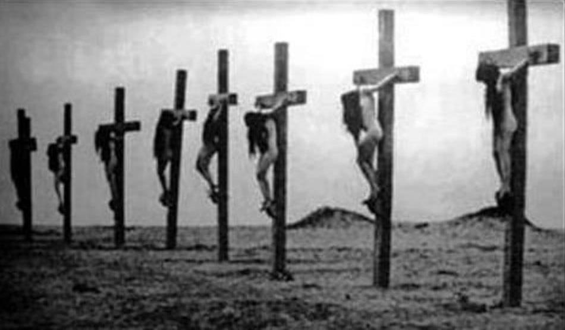

# 1了解

## 前行广释14课

五、边地：假设转生在佛教不兴盛的边鄙地方，那里无有教法、证法，也没有佛教的四众弟子，因而不会有修法的机会。

现在有些城市中，连三宝的名号也不知道，佛与神都分不清楚，尤其是汉地个别偏僻地方，对佛教一无所知，许多思维方式非常可怕，根本没有取舍因果的概念。如果转生到那里，肯定无缘修行正法。

包括在座的有些道友，自己家乡没有佛教，可以称之为边鄙地方，你家里若出一个出家人，觉得给整个种姓带来耻辱。本来按理讲，你的家族世世代代造恶业，好不容易有个出家人，应像得到如意宝一样欢喜，正如古大德所说：“一子出家，九族升天。”所有的亲人都蒙受利益。可是他们有一些颠倒观念，认为：“我女儿出家了，回来时千万别剃着光头啊！如果能回家过年，可不可以留些头发？短一点也可以。不然，我在别人面前实在抬不起头来。”这就是所谓的边地。佛经中也说：“生在边方鄙恶处，耳不曾闻说法声，无识恒居蔑戾车[\[5\]](applewebdata://C4F7F604-1D88-4B06-8879-0CBF926B8978#_ftn5)，此处岂能闻正法？”

有时候我看你们不争气、不好好修行，心里不舒服，生厌离心，但跟世间人比起来，你们放弃家庭、事业，顶住种种的压力，来到清净地方出家，我觉得还是很伟大。有些人头发留得非常好，却想方设法把它剃掉，即使没有找到人，也自己动手把它剃光，这是需要一定勇气的。相信大家也看得到，如今大多数人每天杀盗淫妄，造恶业比谁都擅长，造善业却什么都不懂，甚至听到“三宝”的名字，认为是玛瑙、珊瑚、钻石等三个宝贝。在这样的环境中，今生有缘修行正法，真的非常难得！

## 扩展阅读

[https://zh.wikipedia.org/wiki/亚美尼亚种族灭绝](https://zh.wikipedia.org/wiki/亚美尼亚种族灭绝)



