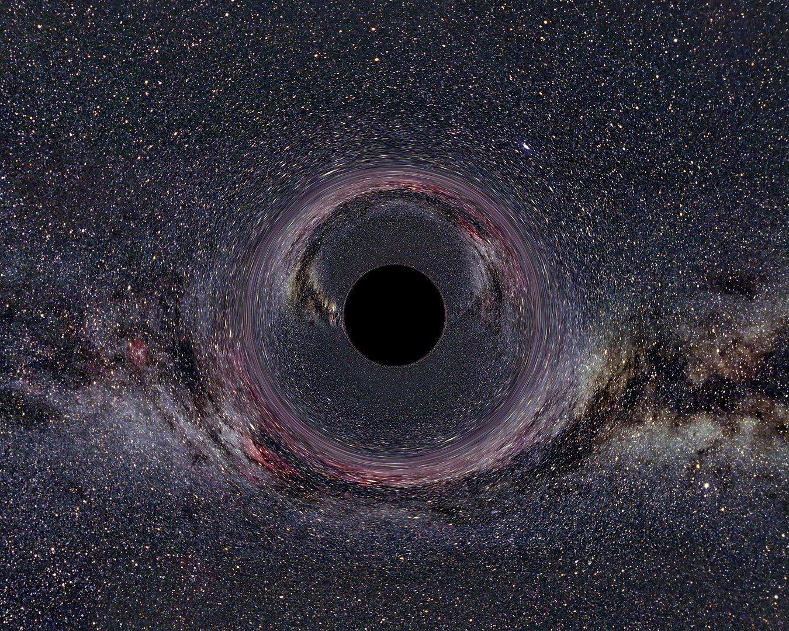

# 1了解

## [系列四.祖师心髓5-大圆满龙钦宁提前行引导文备忘录•暇满难得](http://www.xianmifw.com/treasure/book.php?id=155)

益西彭措堪布 

一、地狱者，修习处所、根身、苦状、寿量四者。处所：是漆黑的处所，一切地基全是烧热的铁地，如同余烬的炭火般，连基本放脚之处也见不到。红黑的火山冒着一尺高的火焰，从上空降下炭火雨、烧石雨、兵器雨。

### 环境

首先观修热地狱的处所，要把握“一总三别”。“一总”是黑漆漆，“三别”是地、周围、空。

那些黑漆漆的地方，见不到一丝光亮。一切地面全是燃烧的铁地，如余烬的炭火般极其炽热，不必说休息之地、会客之地或者能安闲走走的地方，即使是基本落脚的地方或逃脱之处都没有，无论脚落何处都要被烧焦。再看周边环境都是红红黑黑的火山，山上炽燃着一尺高的火焰。上空不断降下密密麻麻的刀剑雨、烧石雨、炭火雨。

根身比南赡部洲人的四倍还大，有的身色如同血染般，有的如薄薄的羊毛团，有的像太子刚诞生那样的薄皮肤，肉绷得紧紧的，极其透明，如眼球般不堪触碰。头发直竖，三角眼，身毛耸立，身肢粗大，腹部很大，就像忿怒尊一样。南赡部洲的人见到这些地狱有情，能吓昏他们。

### 身体

接下来观修地狱有情的身体，需要把握三大要点：一、大；二、薄；三、苦。

大：身体比人的四倍还大，相当于两层楼的高度。在如此庞大身体的上上下下一切处都必须受苦。

薄：皮肤特别薄。有的看上去像全身被血染一般，因为外层的皮肤太薄，连里面的血都看得清清楚楚，稍微碰触一下都会特别痛。有的看起来如同薄薄的羊毛团，也是皮肤特别薄，松松的，直接能触及内部。还有如刚刚诞生的太子的薄皮肤，极其透明，里面的肉绷得紧紧的，就像脆弱的眼睛，沾不得一粒细沙。想一想，如此细薄的皮肤被炽热的火、兵器穿刺，该会有多痛？

苦：高高大大的身躯，头发都竖起来，三角眼，身上的毛也竖了起来，手、脚、脑袋等都很大，再加上肚子也非常大，使他看起来就像忿怒尊一样，这种感受大苦的可怜身相，如果我们见到都会吓昏过去。总之，皮肤细薄，又要感受极强烈的火烧，身体庞大，每一处都得受苦，应当如是来了解。

### 苦状

苦状：白天不闲，夜里不眠，没日没夜地受兵器宰割。又复地基和烧石雨对身体不分头尾地烧，丝毫无有安乐的机会而受苦。

再观察受苦的情况，是不分昼夜、无时无刻都受到兵器宰割。如果白天有清闲的时候，或者晚上睡眠暂忘痛苦也还好，但是堕在热地狱里没有一刻闲暇，也没有一刻睡眠，他们日日夜夜受着剧烈大苦。空中接连不断地降下兵器雨，时时被刀剑宰割，岂能有得乐的机会？地面也没有一处可躲避，处处都在燃烧，上空又有烧石雨往下降。旁边还有火山，热气直往身上扑。总之，身心处在剧烈的苦受中，连一秒钟得少许乐的机会也没有。

### 寿量

寿量：须在超过年数的中劫等中受苦。

寿量是多少呢？在超过年数的中劫等中不断受苦，哪可能会有闲暇？

我们可以结合对比来了知自己目前状况的可贵。之后思维：自身既然脱离了热地狱，就一定要修法。

寒地狱者，处所是雪山冰冻的区域，风雪弥漫；身与热地狱相同；苦是寒冻之苦；寿量须无量年数中受报。

对于寒地狱，同样从处所、根身、苦受和寿量四方面作分解观修，再总合起来就知道他们的处境实在无暇。而我如今脱出寒地狱的无暇，拥有闲暇，是多么宝贵！一定要好好修法。

首先观察处所，寒地狱处在雪山冰冻的区域里，零下几千度，这是地面的状况。周围雪山环绕，空中降下极冰冷的雪，寒风凛冽，全身上下没有一处不被冻伤，完全落在极度冰寒的状况中。根身与热地狱相同，身量庞大，皮肤薄得透明，经不起触碰，任何冷触都会导致剧烈的疼痛。苦是时时受着酷寒，无有丝毫安乐的机会。寿量是无量的年岁。

思维：现在生在如此的寒热地狱中，修圣法是有暇还是无暇？数数思择而修。又如是思择后，如果心疲累而不肯动的话，则不回忆过去、不迎接未来、不使现在的妄念相续，而在无修整中止住修。又开始动念时再作思择，不想动念时又止住，如是思择和止住轮番而做。

之后思维：如果我现今生在此等寒地狱、热地狱中，是有暇修法还是无暇修法呢？在漫长的时间里，被业报严重逼迫，身不由己地感受业力的惩罚，必定连一刹那修法的机会也没有。如今我从早到晚有成千上万的刹那都可以修法，为什么要白白浪费呢？如果没有倍加珍惜，万一堕到地狱里该怎么办呢？如是，常常思维那些可怜的地狱众生，对比之下，现在的状况的确是昙花一现，必须好好珍惜。

“数数”是一遍又一遍，“思择”是指透过思维来抉择认定，取得定解。多番思维后心会感觉疲惫，不肯再想，此时适合作止住修或舍修，也就是不想过去、不想未来、不让现在的妄念相续，自自然然地止住即可。当它止住的时候不去修改什么，叫做“无修整”，好比一屋子的东西都不再经管、理会，是怎样就怎样。疲累使得妄念自然不起，分别心的劲头歇息，我们也就可以趁势放下。

也就是说，此中无非是举修和舍修。有劲头思虑的时候，就提起来，不断地运转思维，作出多番抉择，这叫“举修”；疲累的时候则适合“舍修”，全部放下，什么也不想。止到差不多时又开始动念，就再作思择，来适合当下的状态。

分别念想要发动时，就开始去抉择；不想变动时，就停住，如此以观修和舍修轮番进行。轮番的目的是昼夜处在如法的状态中，而不是落于非法。使非理作意、昏沉、散乱等烦恼无隙可入，不断地转起修法之轮，即称“轮番而做”。总之，作为修法者重在一心依法，不是举修就是舍修，以此两种方式交相轮替而不断地处在修法状态，不要让心处在非法状态，不要让妄念有可乘之机。现在即作舍修，因为大圆满到最终是要截断妄念，提前就应当配合来试修，来逐渐进行锻炼。

地狱众生的寿命--劫

## [系列二.大圆满龙钦宁体前行实修引导讲记一· 暇满难得](http://www.xianmifw.com/treasure/book.php?id=136)

具体是哪八种无暇之处呢？接下来透过理由一一认定。其中所说的任何一个“故”字，都是理由或者原因，也是我们思维的关键处。以此提示我们，认识无暇不是随人而说、简单重复，而是需要通过道理来证成，观察点是在道理上，所以叫做“具因相的信心”。也就是透过理由、原因，发现实际的确如此，才会认定每种情况全是无暇，根本没有修法的能力或者机缘。然后进一步观察到：我没落到这种地步，而是脱离了八种无暇，因此是有闲暇人身的体性。八种无暇都是透过因或者理由来得到定解，其中的“故”字才显得特别重要。

如果生在地狱，就会连续不断地感受极其炽猛的寒热之苦，以寒热苦强故、连续不断故，内心根本无法趣入或没有闲暇修法。这一点我们可以透过类比来认识，譬如癌症晚期，痛得在床上打滚，身心被痛苦牢牢钳制时，根本无法安稳地运转自心来修法。或者寒冬腊月零下30度，光着身子在野外，整个身体都颤抖，心也跟着不稳定，就不可能出现修法的空间或者状态，这叫做“无闲暇”。

“暇”要理解成内心修法的空间或者时间态，心在因缘点上不能契合的时候就发不起修法，结果只有受苦的份，一直都在苦受的逼迫、压挤或焦灼等当中，内心根本生不起一种很宽松、很安闲的修法状态，叫做“无暇修法”。把人间剧烈的寒苦、热苦、病苦，乘上一亿倍、十亿倍，可以想见，那种状态的确绝对没有修法的时间。旷大劫来，地狱众生便是如此不断地感受惨烈剧苦。在受生地狱的整个遭遇当中，连一秒钟修法的时间都难以得到。除了一些善根成熟、业报消尽或者有极特殊因缘，以佛力加被使痛苦暂时得以止息，从而生起善念或者缘念正法之外，其他几乎不可能。由此得知：原来地狱是无暇处，一旦受生其中，难有修法的可能。如是认定第一无暇处。

